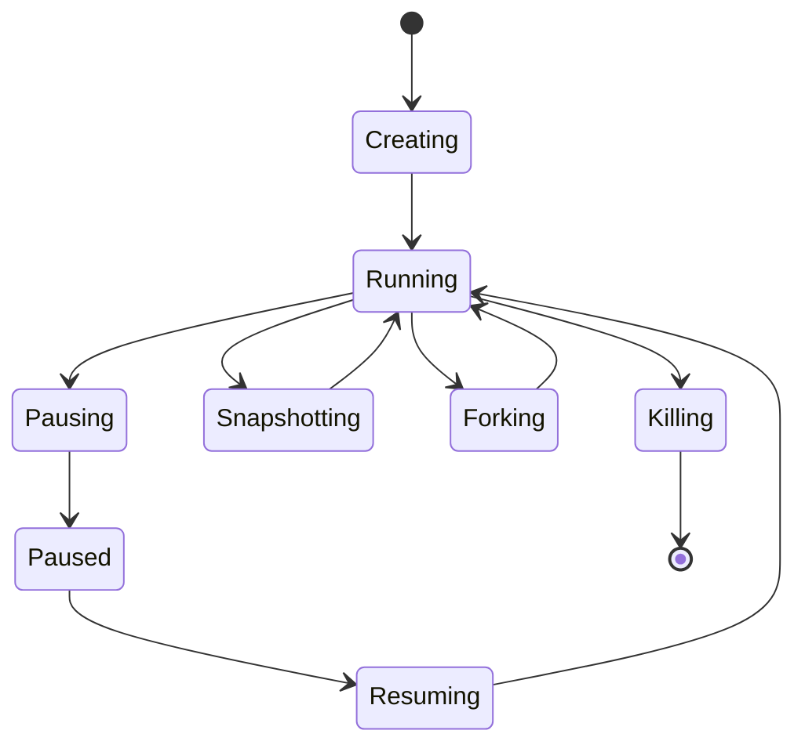

# Sandboxes

A sandbox is an isolated Firecracker microVM with its own Linux kernel,
filesystem, processes, and network stack. It is the environment where you run
code, use tools, modify files, and start services.

A sandbox moves through the lifecycle shown below.

| State | Description |
|-------|-------------|
| **Creating** | VM is booting, block devices are being attached, networking is being configured |
| **Running** | VM is ready. Commands can be executed, proxy traffic is routed, timeout is ticking |
| **Pausing** | Memory and disk snapshots are being captured |
| **Paused** | VM is stopped. Snapshot artifacts are stored. No resources consumed |
| **Resuming** | Sandbox is being restored from its paused snapshot |
| **Snapshotting** | A persistent snapshot is being captured; sandbox returns to Running after |
| **Forking** | Sandbox is being cloned into child sandboxes; source returns to Running after |
| **Killing** | VM is being torn down and resources released |

---

Where to Go Next:

- [Starting a Sandbox](./starting.md) — start a sandbox from a template, snapshot, or OCI image.
- [Working with Sandboxes](./working.md) — basic commands such as connect, execute commands, transfer files, pause, snapshot, fork, and delete.
- [Auto-Eviction](./auto-eviction.md) — configure TTLs and expiration behavior of the sandbox.
- [Networking](./networking.md) — configure ingress and egress policies of the sandbox.
