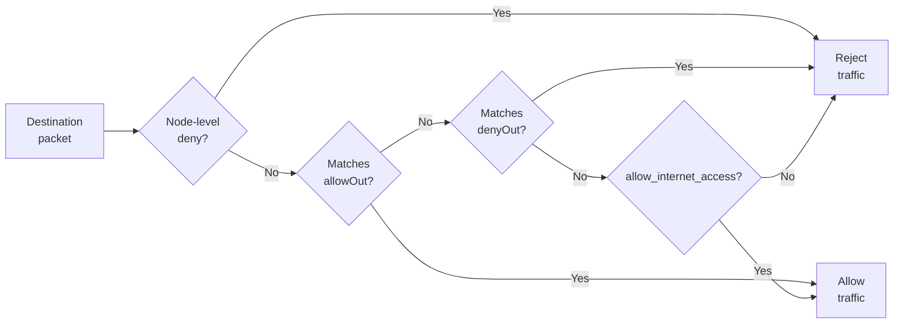

# Networking

Each sandbox has an isolated network stack. Networking controls two separate boundaries:

- **Egress:** which IP addresses, CIDRs, and domains the sandbox can connect to.
- **Ingress:** whether services exposed through the AgentENV proxy are public or require the sandbox traffic access token.

## What You Can Configure

Network configuration has two levels. Configure node-level guardrails in the
AgentENV config file; they apply to every sandbox on that node. Configure
sandbox-level policy by sending fields in sandbox API requests. Sandbox egress
policy can be set at creation and replaced later with an update request.

| Scope | Field | Default | Meaning |
|---|---|---|---|
| Sandbox | `allow_internet_access` (warm)<br>`allowInternetAccess` (cold) | `true` | Base egress policy. `false` rejects destinations not explicitly allowed. |
| Sandbox | `network.allowOut` | Empty | Allowed IPv4 CIDRs, IPs, or domain patterns. |
| Sandbox | `network.denyOut` | Empty | Denied IPv4 CIDRs or IPs. Domains are not supported. |
| Sandbox | `network.`<br>`allowPublicTraffic` | `true` | Whether proxied services are public. When `false`, requests require a traffic access token. |
| Node | `[network.egress].`<br>`always_denied_cidrs` | Configured in AgentENV config file | CIDRs denied before sandbox policy. Sandbox `allowOut` cannot override them. |

## Matching Rules

Rules are evaluated in this order:



`allowOut` can override an overlapping user-configured `denyOut`, but it cannot
override node-level internal/reserved-network deny rules. Setting
`allow_internet_access: false` adds a deny-by-default base policy after the
explicit rules.

Domain names can be used only in `allowOut` for HTTP/HTTPS connections. Exact
names and wildcard forms such as `*.example.com` are supported. If `allowOut`
contains a domain, also set `denyOut` to `["0.0.0.0/0"]`; this blocks other
destinations and leaves the listed domains as the allowed exceptions.

## Configure at Creation

Both warm and cold sandbox creation support network policy.

Warm start from a template or snapshot:

```bash
curl -X POST \
  -H 'X-API-Key: test-key' \
  -H 'Content-Type: application/json' \
  -d '{
    "templateID": "my-ubuntu",
    "network": {
      "allowOut": ["*.example.com"],
      "denyOut": ["0.0.0.0/0"],
      "allowPublicTraffic": false
    }
  }' \
  http://127.0.0.1:8000/sandboxes
```

Cold start from an OCI image:

```bash
curl -X POST \
  -H 'X-API-Key: test-key' \
  -H 'Content-Type: application/json' \
  -d '{
    "image": "ubuntu:24.04",
    "allowInternetAccess": false,
    "network": {
      "allowOut": ["8.8.8.8/32"]
    }
  }' \
  http://127.0.0.1:8000/sandboxes-cold
```

## Update a Running Sandbox

Replace the egress policy of a running sandbox:

```bash
curl -X PUT \
  -H 'X-API-Key: test-key' \
  -H 'Content-Type: application/json' \
  -d '{"allowOut": ["8.8.8.8/32"], "denyOut": ["0.0.0.0/0"]}' \
  http://127.0.0.1:8000/sandboxes/<sandbox-id>/network
```

The update replaces the current egress rules. Omitting both `allowOut` and
`denyOut` clears the per-sandbox lists; omit `allow_internet_access` as well to
restore the default base policy.

In the current implementation, updates primarily affect new connections and do
not actively terminate existing ones. For domain-policy replacement, the old
policy remains active until the new namespace rules are installed and the new
proxy policy is activated.
