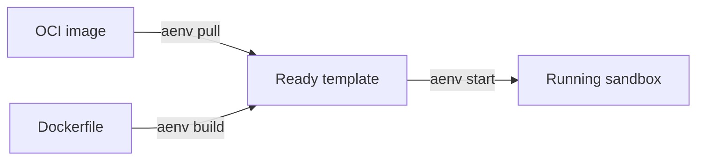

# Templates

A template is a reusable starting point for launching sandboxes. Build or
import it once, then use it to create sandboxes whenever you need the same
software and configuration.

## Lifecycle

## Relationship to Snapshots

Templates are the API and UX layer. Snapshots are the durable runtime layer.

- A template build publishes one committed snapshot.
- A template ID or alias resolves to one committed snapshot.
- A sandbox created from a template resumes from that snapshot.

If you want the storage and runtime model underneath templates, see
[Snapshots](../snapshots/index.md).

---

Where to Go Next:

- [Create Your Template](./creating.md) — create a template from an OCI image or Dockerfile.
- [Manage Templates](./managing.md) — list templates, review build history, resolve aliases, and delete templates.
